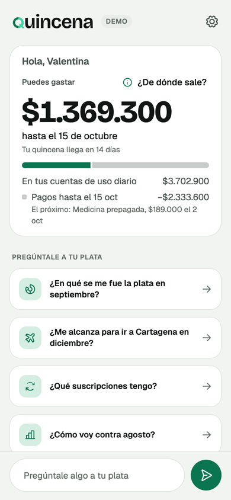
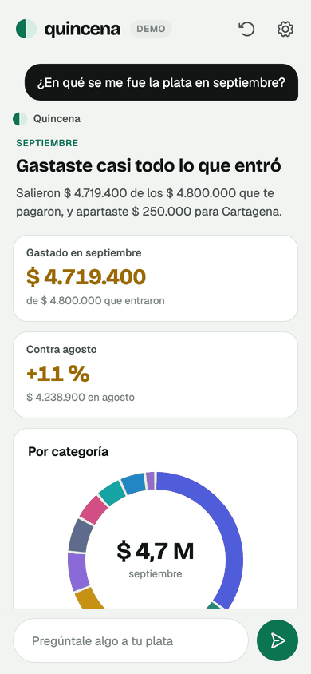
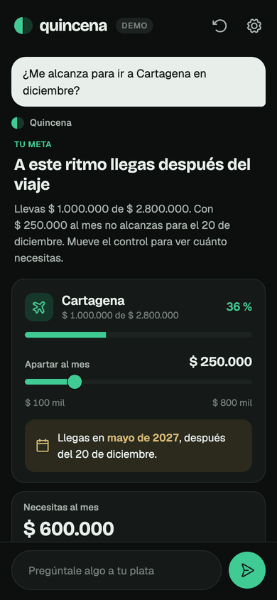
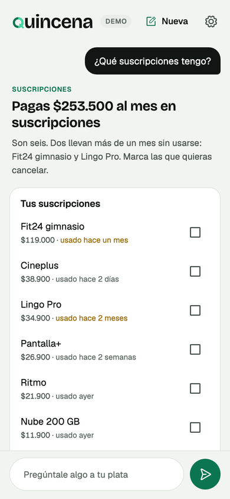
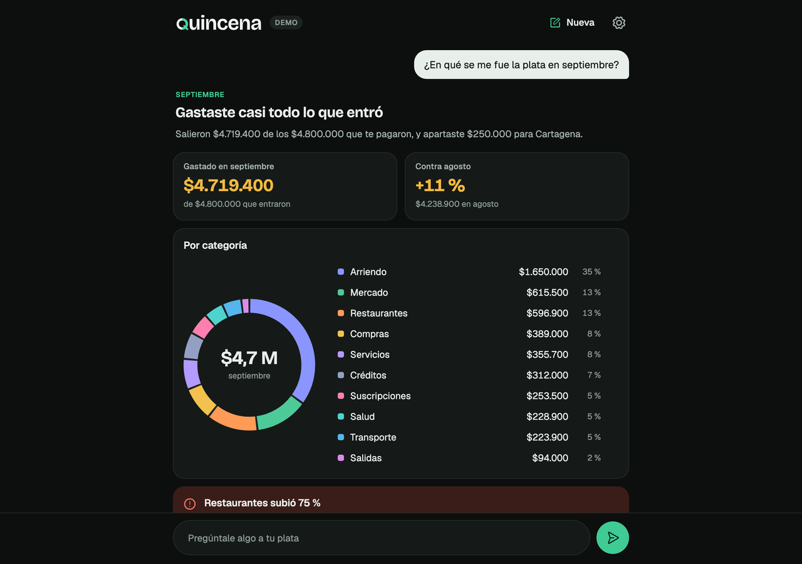
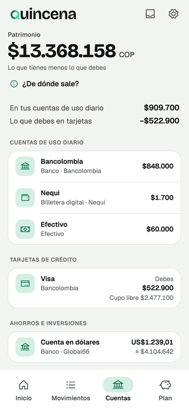
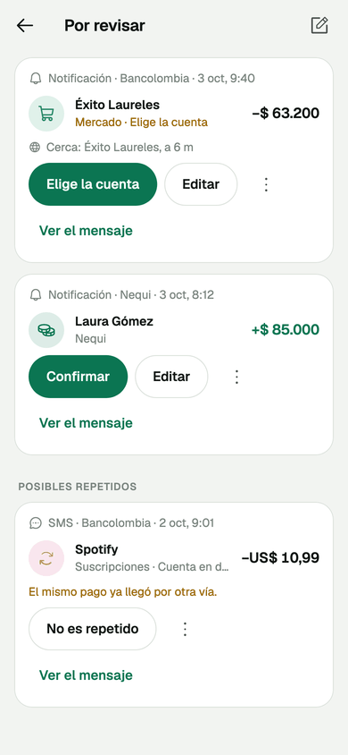
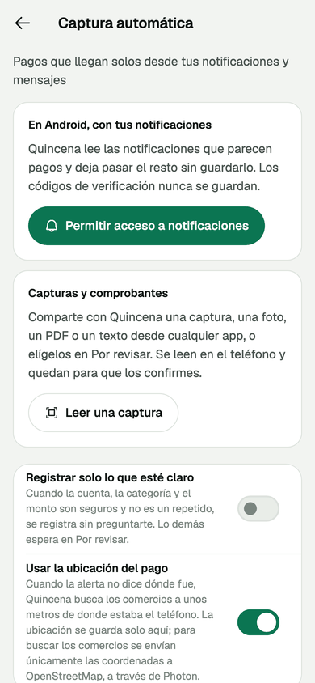

# Quincena

[](https://github.com/diegolopezrm/quincena/actions/workflows/ci.yml)

Personal finance where every answer is an interface.

**[Try it in the browser](https://diegolopezrm.github.io/quincena/)**, in
Spanish or English. It needs no account and no key: a scripted agent answers
the questions on the home screen, and "Lo que respondió Gemini" replays five
sessions Gemini answered for real.

<p align="center">
  
  
  
  
</p>

Ask where September's money went and you get a donut chart, the two things
that moved and the five largest payments. Ask whether you can afford
Cartagena in December and you get a goal with a slider: drag it and the
arrival date recalculates on the device, with no new message from the agent.
Ask what subscriptions you have and you get a list with a switch on each row
and a footer that says what cancelling the switched-off ones would save.

None of those screens is in the source. An agent composes each one at runtime
from a catalog of components, with [genui](https://pub.dev/packages/genui)
rendering them and [genui_gen](https://pub.dev/packages/genui_gen) deriving
the catalog from the widgets' own constructors.

The account is made up. Valentina is a designer in Medellín, paid on the 15th
and the last day of the month, saving for a trip while she pays off a student
loan. Every merchant is made up too.

<p align="center">
  
</p>

## What it shows

**A catalog with no second source of truth.** Twenty components and six
functions, each written as an ordinary Flutter widget or Dart function and
annotated. The JSON schema the agent composes against, the builder that turns
its JSON back into the widget, and the example data are generated from the
constructor. [`catalog.json`](catalog.json) is the same catalog as an agent
outside the app sees it, checked against the Dart on every test run.

**Interfaces that keep working after the agent is done.** The goal planner's
slider writes to the data model, and two catalog functions read from it to say
when the goal is reached and whether that is in time. The subscription list is
a template repeated over the data, each row's switch writes to its own entry,
and a function over the whole list totals the savings. A form validates with
rules the agent wrote, and the message of the first failing rule shows under
the field.

**The tooling around it.** Turn on developer mode in settings and the
genui_gen inspector sits over the conversation: the component tree the agent
built, every data path with what reads it, what a screen reader announces,
and the messages that got the screen there. "Copiar la sesión" puts the
whole session on the clipboard as a genui_gen trace, with what the person
typed into a form redacted, ready to paste into an issue and replay.

**Two languages.** The app speaks Spanish and English, following the device
or the choice in settings. The scripted answers, the prompt Gemini gets,
the catalog's own words and every amount and date switch together:
`$ 4.719.400` and `19 sept` in Spanish, `$4,719,400` and `Sep 19` in English.

## Your own accounts

On a phone or the desktop, "Con mis cuentas" sets Quincena up with your own
money instead of Valentina's: how you get paid, your accounts in pesos,
dollars or crypto, and what comes in and goes out. It all stays in a SQLite
database on the device. Totals convert to the currency you pick, with the
official TRM for dollars and Binance's prices for crypto.

<p align="center">
  
  
  
</p>

## Automatic capture

Payments reach Quincena without anyone typing them.

- **iPhone.** The app adds a "Record a movement" action to Shortcuts. An
  automation on Wallet hands it each Apple Pay payment, one on Message the
  bank's texts and, from iOS 27, one on Notification the banks' apps. It runs
  without opening Quincena.
- **Android.** With notification access, Quincena keeps the notifications
  that carry an amount next to a currency and lets the rest go by unread.
  Security codes are never kept, and any app can be muted.
- **Screenshots, receipts and texts.** A screenshot, a photo or a PDF of a
  payment is read on the device, with Vision on the iPhone and the Mac and
  ML Kit on Android. On Android, share it with Quincena from any app; on the
  iPhone, pick it in "Por revisar", or make a shortcut with the "Read a
  receipt" action and turn on "Show in Share Sheet". What is read from an
  image always waits to be confirmed.
- **Anywhere.** A message pasted into "Por revisar" is read the same way.

Everything goes through one parser, written for how Colombian banks and
wallets word their alerts: `$45.900,00` or `$45,900.00`, the merchant, the
card's last four digits, a balance that is not the purchase. A receipt is
read by its labels: the figure after "Valor" or "¿Cuánto?", who got it after
"Para", the date and time it says, not the clock at the top of the
screenshot. A payment seen
by Wallet, the bank's push and an SMS becomes one movement, and one already
entered by hand is not suggested again. Confirming a capture teaches
Quincena that card's account and that merchant's category. With "Registrar
solo lo que esté claro" on, the next one goes straight in, and can be undone.

When an alert only says "Compra POS 4512", the location fills the gap. With
it on, Quincena looks up the shops within 80 metres of where the phone was,
in OpenStreetMap's data through [Photon](https://photon.komoot.io), and
proposes the nearest. The coordinates are the only thing that leaves the
device. Android asks for "Allow all the time" for this, since payments
arrive while the app is closed; the app says why before asking.

## Run it

```bash
flutter pub get
flutter run -d chrome
```

The demo runs offline. A scripted agent answers the questions on the home
screen with the same components, bindings and function calls a model sends,
and every number in its answers comes from the account, so saving an expense
changes the next answer.

On iOS and macOS the plugins, Firebase among them, come in as Swift packages
(`pubspec.yaml` turns Swift Package Manager on for this app), so there is no
CocoaPods step.

## Talk to Gemini

On an iPhone, an Android phone, a Mac or the web, "Pregúntale a tu plata"
asks Gemini about your own accounts, with no key. The questions go through
Quincena's Firebase project with Firebase AI Logic, which only answers the
real app (App Check: App Attest on Apple devices, Play Integrity on
Android, reCAPTCHA Enterprise on the web). Each person signs in anonymously
so the project can count their requests, with a cap of 20 a minute set on
the project and 30 questions a day in the app. Gemini gets the numbers from
tools that run on the device, the demo's plus every account in its own
currency, never the database, and "Qué ve Gemini" in the app says what
travels in plain words.

What is set up for production, which limits stop spending and which only
warn, and what Google may do with what is sent on each plan is in
[docs/PRODUCTION.md](docs/PRODUCTION.md).

For the demo account, settings offers the same Gemini, or a key of your own
from [Google AI Studio](https://aistudio.google.com). A key is not saved, and
it only travels to Google.

Gemini gets the catalog through genui's prompt builder, with two of its
defaults switched off: the chat preset forbids `updateDataModel`, which every
interactive component here relies on, and tells a model that cannot run code
to do arithmetic itself, which a finance app must never let it do. It gets
the numbers from tools that ask the account, never from its own head. When a
surface it sends fails validation against the catalog, genui reports why and
the app sends that back within the same turn, so the person sees the
corrected answer rather than the broken one.

A simulator, an emulator or a local web build passes App Check with a debug
token registered in the project, read at build time from a file that is
never committed:

```bash
flutter run --dart-define-from-file=tool/app_check.local.json
```

For a local run with your own key you can also pass it at build time:

```bash
flutter run -d chrome --dart-define=GEMINI_API_KEY=your-key
```

Never do either for a build you publish: a web build made with the key or
the token defined carries it in its JavaScript.

## Recording real sessions

```bash
GEMINI_API_KEY=your-key flutter test tool/record
```

asks Gemini each question on the home screen and writes what it sent to
`assets/traces/` as genui_gen traces. The app replays them in "Lo que
respondió Gemini", step by step and with no network, and
`test/recorded_test.dart` replays every one against the current catalog on
each run, so a catalog change that would break a real conversation fails a
test instead of a person.

After changing a widget or a function, regenerate the catalog:

```bash
dart run build_runner build --delete-conflicting-outputs
```

## Tests

```bash
flutter test
```

Besides the answers themselves, in both languages and at twice the system
text size, the catalog is held to three things.
`genUiFuzz` renders everything the schema allows and fails on anything that
breaks. `genUiSemanticsAudit` fails on a control a screen reader cannot name.
And `catalog.json` has to match the Dart.

The first two earned their place on the first run. The fuzzer found that every
component crashed under any theme but the app's own, and the audit found that
the goal slider announced its value without saying what the value was of.

## Layout

| Path | What is there |
|---|---|
| `lib/catalog/` | the components the agent composes with, and the data shapes they take |
| `lib/functions/` | the functions the agent can call from a binding |
| `lib/agent/` | the assembled catalog, the prompt, the tools, the scripted agent and the live one |
| `lib/data/` | the sample account: movements, subscriptions, the goal |
| `lib/money/` | assets, decimal amounts, exchange rates and where they come from |
| `lib/domain/`, `lib/store/` | accounts, movements and pay schedules, and the SQLite database they live in |
| `lib/capture/` | the parser, the deduplicator, the inbox and the lookup of nearby shops |
| `lib/ui/` | the conversation, and in `own/` the screens for your own accounts |
| `ios/Runner/` | the Shortcuts actions, and the text reader the Mac shares |
| `android/app/src/main/kotlin/` | the notification listener, the share target and the text reader |

## Credits

Type is [Bricolage Grotesque](https://fonts.google.com/specimen/Bricolage+Grotesque)
and [Geist](https://fonts.google.com/specimen/Geist), under the SIL Open Font
License. Icons are [Phosphor](https://phosphoricons.com), under the MIT
license. The licenses sit next to the files in `assets/`.
